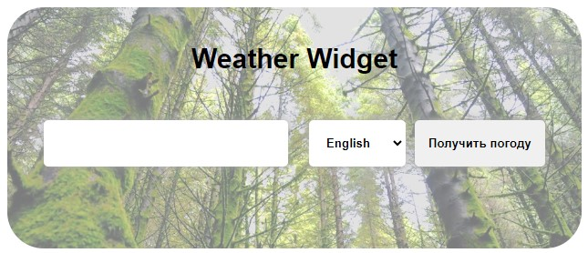
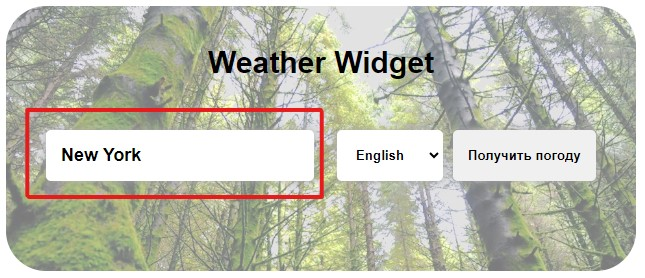
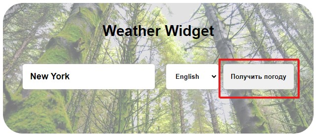
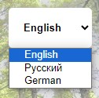
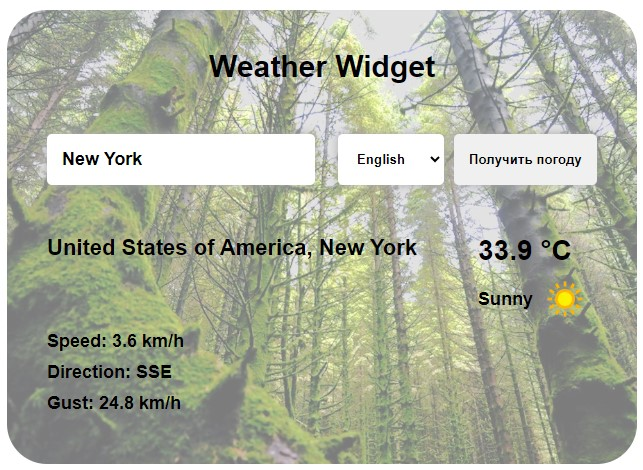

# Weather Widget 

#### Weather Widget - это простой погодный виджет для получения погоды в определённом городе. Функционал построен на получении данных от бесплатного API погоды и последующей их отрисовки. В приложении можно выбрать 3 языка на выбор: Русский, Английский и Немецкий. В зависимости от выбранного языка будет меняться выводимый текст погоды.

## Общий вид приложения

## Функционал

- Ввод города (получение данных о погоде происходит после нажатия кнопки "Получить погоду")
  
    

    

- Выбор языка получения данных о погоде
  
    

## Вид приложения после получения данных

## Стек технологий

- HTML
- CSS
- JavaScript
